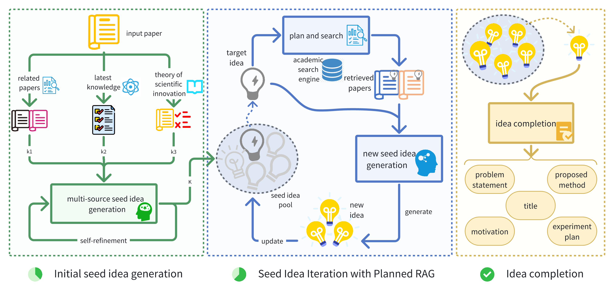

# NOVA

Welcome to the **NOVA: An Iterative Planning Framework for Enhancing Scientific Innovation with Large Language Models** repository.
🔥🔥🔥 Paper: https://arxiv.org/abs/2410.14255



## Abstract

Scientific innovation is pivotal for humanity, and harnessing large language models (LLMs) to generate research ideas could transform discovery. However, existing LLMs often produce simplistic and repetitive suggestions due to their limited ability in acquiring external knowledge for innovation. To address this problem, we introduce an enhanced planning and search methodology designed to boost the creative potential of LLM-based systems. Our approach involves an iterative process to purposely plan the retrieval of external knowledge, progressively enriching the idea generation with broader and deeper insights. Validation through automated and human assessments demonstrates that our framework substantially elevates the quality of generated ideas, particularly in novelty and diversity. The number of unique novel ideas produced by our framework is 3.4 times higher than without it. Moreover, our method outperforms the current state-of-the-art, generating at least 2.5 times more top-rated ideas based on 170 seed papers in a Swiss Tournament evaluation.

# Quick Start with Nova
## Set Environment

1. **Clone the Repository**
```shell
git clone xxx
cd Nova
```

2. **Create a Virtual Environment:**
```bash
conda create -n Nova python=3.11
conda activate Nova
```

3. **Install Dependencies:**
```bash
pip install -r requirements.txt
```

4. **Set Configuration:** Update config.yaml to set LLM APIs:
```bash
# set it if you set is_azure to True
AZURE_OPENAI_ENDPOINT : ""
AZURE_OPENAI_KEY : ""
AZURE_OPENAI_API_VERSION : ""

# set it if you set is_azure to False
OPENAI_API_KEY: ""
OPENAI_BASE_URL: ""
```

5. **Prepare Environment:**
```shell
source env.sh
```

## Prepare Academic Search Engine
Our academic search engine is built on FAISS, with AI-related papers covering the period from 2022 to 2024. For embedding generation and similarity computation, we utilize the all-MiniLM-L6-v2 4 model, which provides a balance between efficiency and performance for academic paper representation.

### Create FAISS Index
```bash
python src/academic_search_index_builder.py
```

### Serve the Academic Search Engine
First, update config.yaml, then load the FAISS index and use Flask to serve the academic search engine.

```shell
EMBEDDING_MODEL_DIR: "all-MiniLM-L6-v2"
RERANK_MODEL_DIR: "ms-marco-MiniLM-L-6-v2"
FAISS_INDEX_DIR: "faiss/"
```


```bash
python deploy/academic_search_engine_server.py test
```

## Generate Idea
```bash
python src/main.py test
```
You can find the final proposal after deduplication in the step_3_final_proposal directory.

## License

This project is licensed under the [MIT License](LICENSE). You are free to use, modify, and distribute the code as per the terms of the license.


## Citation
If you find our work useful for your research and applications, please cite using this BibTeX:

```bibtex
@misc{hu2024novaiterativeplanningsearch,
      title={Nova: An Iterative Planning and Search Approach to Enhance Novelty and Diversity of LLM Generated Ideas},
      author={Xiang Hu and Hongyu Fu and Jinge Wang and Yifeng Wang and Zhikun Li and Renjun Xu and Yu Lu and Yaochu Jin and Lili Pan and Zhenzhong Lan},
      year={2024},
      eprint={2410.14255},
      archivePrefix={arXiv},
      primaryClass={cs.AI},
      url={https://arxiv.org/abs/2410.14255},
}
```